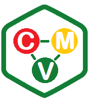
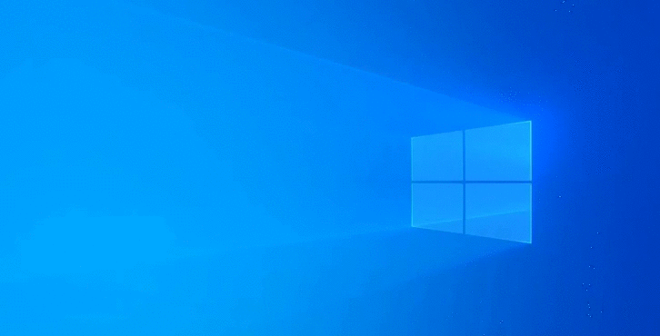

<h1 align="center">
  
</h1>

  <a href="#-tecnologias">Tecnologias</a>&nbsp;&nbsp;&nbsp;|&nbsp;&nbsp;&nbsp;
  <a href="#-projeto">Projeto</a>&nbsp;&nbsp;&nbsp;|&nbsp;&nbsp;&nbsp;
  <a href="#-layout">Layout</a>&nbsp;&nbsp;&nbsp;|&nbsp;&nbsp;&nbsp;
  <a href="#memo-licença">Licença</a>

 

  

  

## 🚀 Tecnologias

Esse projeto foi desenvolvido com as seguintes tecnologias:

- HTML
- CSS
- JavaScript
- PHP
- Gerenciador de pacotes / COMPOSER

## 💻 Projeto

O Modelo-MVC é um projeto de modelo padrão de arquitetura "MVC" que auxilia na construção de uma aplicação, que nesse caso é uma aplicação WebSite, com as camadas [Controller] - [Model] - [View]. Tendo em vista assim uma melhora na organização dos arquivos, podendo trabalhar em equipe separada por camada por exemplo na camanda da [View] - Trabalha o profissional de "Designer" junto com um "Programador Front-End", na camada [Model] - Trabalha o profissional de "Analista de Dados (DBA)" junto com um "Programador  Back-End",  e por fim na camada "Controller" - O profissional "Programador Full Stack" que consigua trabalha e auxiliar tanto como Front-End como Back-End e entenda como funciona as camadas [Model] e [View]. 

## 🔖 Layout

Você pode visualizar o layout do projeto através [desse link](#).

## :memo: Licença

Esse projeto está sob a licença MIT. Veja o arquivo [LICENSE](./LICENSE) para mais detalhes.